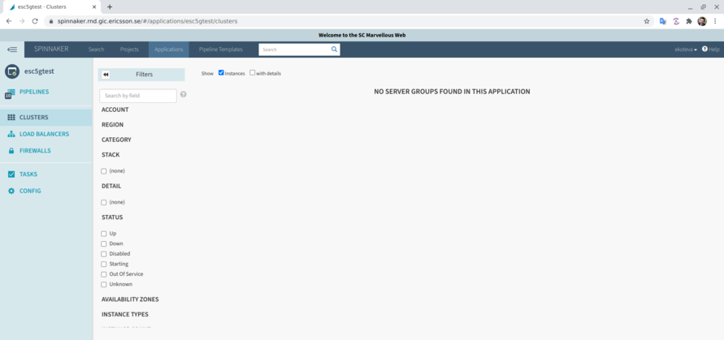
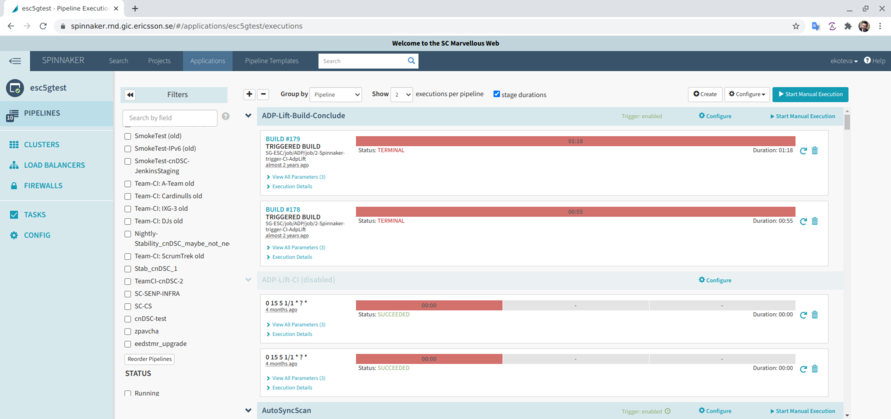
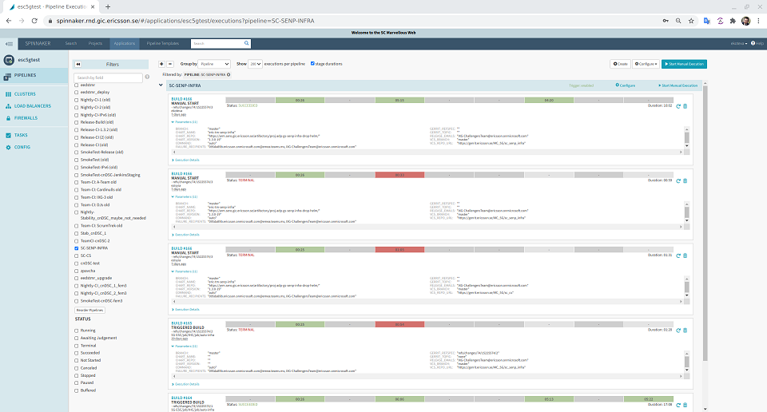
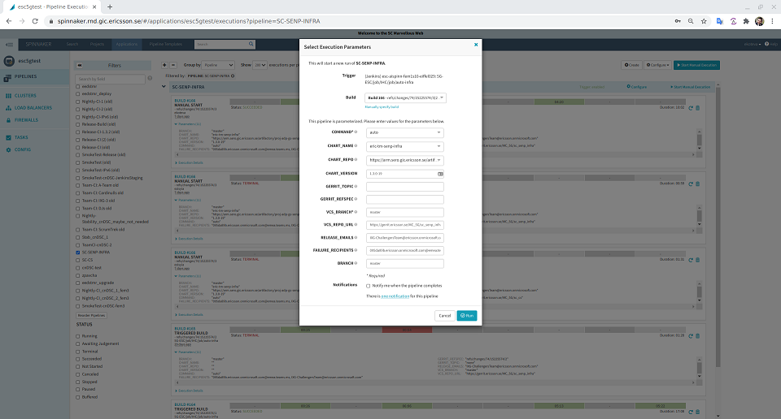
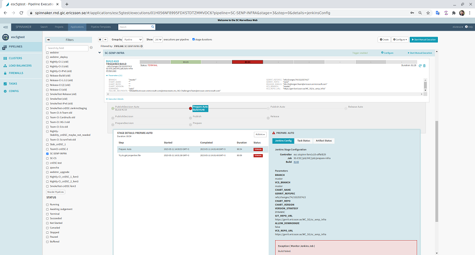
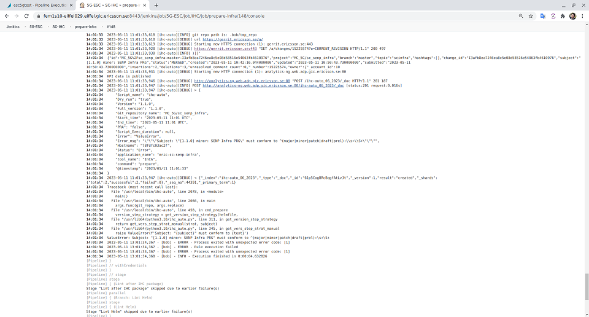
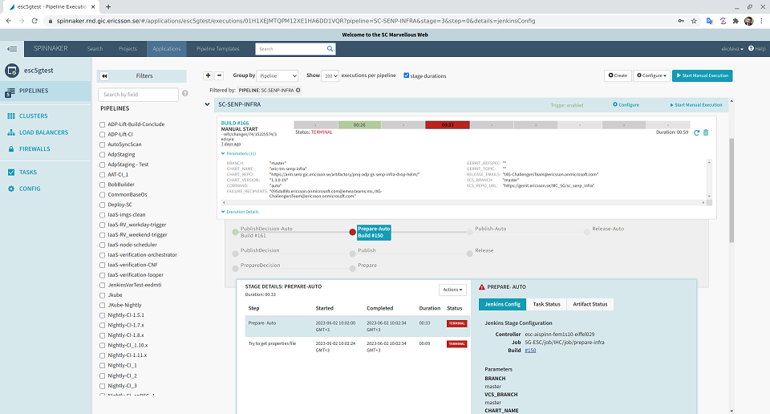
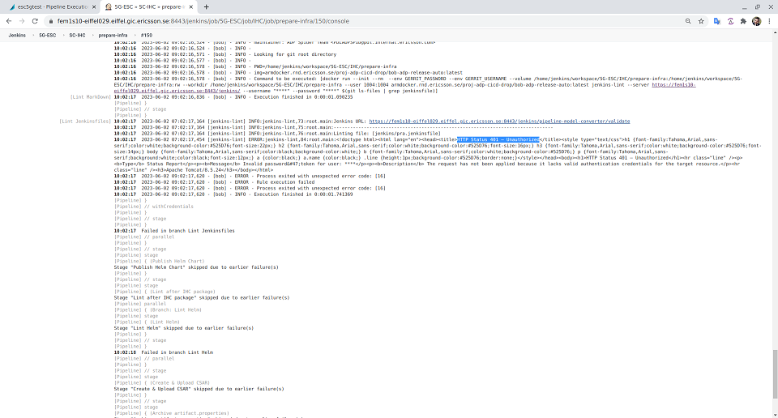

# Contributing to SENP INFRA Application Integration Chart

[TOC]

## Code of Conduct

This project and everyone participating in it is governed by the
[SC Challengers Code of Conduct](CODE_OF_CONDUCT.md}.
By participating, you are expected to uphold this code.

## Project Guardians

The guardians are the maintainer of this project.
They are responsible for maintaining the tools used and review the submitted
patches. All the commits to this project should have at least 2 guardian members
as reviewers of the submitted patchsets.

- [Evaggelos Kottis](mailto://evaggelos.kottis.ext@ericsson.com)
- [Marios Palaskos](mailto://marios.palaskos.ext@ericsson.com)
- [Yiannis Zisis](mailto://yiannis.zisis.ext@ericsson.com)
- [SC Challengers Team](mailto://IXG-ChallengersTeam@ericsson.onmicrosoft.com)

## Development Environment prerequisites

- Kubernetes
- Helm
- Docker
- ARM repository accessible for downloading docker images and helm chart packages
    - [ArmDocker or ArmSeli](https://armdocker.rnd.ericsson.se/)
    - [ArmSero](https://arm.sero.gic.ericsson.se/)
- Git
    - Enable git hook for Change-Id with following command:

```shell
scp -p -P 29418 <user-id>@gerrit.ericsson.se:hooks/commit-msg.git/hooks/
```

- Gerrit access
    - [Ericsson GERRIT](https://gerrit.ericsson.se/)
- Bob

Bob expects you to have a valid docker login towards your docker registry on
the host, currently it can't handle automatic login by itself.
If you are using armdocker, selndocker or serodocker, then you can login with
the following command:

```shell
docker login armdocker.rnd.ericsson.se
docker login selndocker.mo.sw.ericsson.se
docker login serodocker.sero.gic.ericsson.se
```

Note: Make sure you have installed all the [prerequisites of Bob 2.0][1].

Additionally, you have to create respective .artifactory/helm_repositories.yaml
file in your home directory with required helm repostiries credentials like the
example below.

```shell
repositories:
- password: AKCp5fTQ...U9Ps8
  url: https://arm.rnd.ki.sw.ericsson.se/artifactory/
  username: ekoteva
- password: AKCp5fTQ...CC54L
  url: https://arm.epk.ericsson.se/artifactory/
  username: ekoteva
- password: AKCp5fTQ...CC54L
  url: https://armdocker.rnd.ericsson.se/artifactory/
  username: ekoteva
- password: AKCp5fTQ...U9Ps8
  url: https://arm.sero.gic.ericsson.se/artifactory/
  username: ekoteva
- password: AKCp5fTQ...CC54L
  url: https://arm.seli.gic.ericsson.se/artifactory/
  username: ekoteva
```

Note: You should avoid using cleartext password in the files above but instead
you should use correct tokens for both docker and helm repositories.

## How Can I Contribute?

This guide describes how to contribute change and test it but
any changes should be agreed with project guardians.

## Commit the change

Contributors may apply changes on any private or master branch.

All commits should include:

- the gerrit `Change-Id:` inserted by the commit-msg hook.
- JIRA issue number in the title or body.
- the header line of the commit message must follow the pattern
'<major|minor|patch|draft|prel>: Manual patch message'.

If the commit message is not providing any of the expected keyword, the
generation/verification of new integration chart will **fail**. The selection of
Keyword <major|minor|patch|draft|prel> depends on the type of the manual change.

- The Keyword 'major' indicates a Non Backward Compatible change.
- The keyword 'minor' indicates new feature is introduced.
- The keyword 'patch' indicates provided a fix for the bug.
- The keyword 'draft' indicates no change in version, no rebuild or upload of the
helm chart will be done and the manual changes are merged to master in publish stage.
- The keyword 'prel' indicates no change in version, but build and upload of the
helm chart will be done in the prepare stage. In the publish stage the helm package
is built but not uploaded and the manual changes are merged to master.

Please refer to [Versioning Strategy][2] and Section
[VERSION_STEP_STRATEGY_MANUAL][3] for more information.

For example:

```text
minor: [DND Jira Number] <commit message title>
```

Note:

- Please handshake with the Project Guardians regarding which keyword to use in
commit message for the manual changes. If the changes are due to deprecation in
CNCS charts configuration then currently commit message should contain like below
pattern.

```text
major: Deprecation: [DND Jira Number] <commit message title>
```

- Do not apply changes in Jenkins or ruleset files that might create issues on
the automated precode/prepare/publich actions and always consider consulting the
Project Guardians.
- The entire commit message content will be used in the near future to display
for Reason for Revision in the PRI Document as well as in Release E-mail.
Consequently, the commit message should not contain any description except for
the header line

Example:

```text
patch: enhance jenkins pipes and main ruleset

- pra Jenkins
  > fix CHART_NAME description
  > fix CHART_VERSION description
  > fix FAILURE_EMAILS description
  > change timeout from 2min to 15min
- pre-code-review Jenkins
  > fix CHART_REPO_URL description
- prepare Jenkins
  > add 15 min timeout
  > add timestamps
  > change displayName from <build-version> to <build version>
- publish Jenkins
  > add 15 min timeout
  > add timestamps
  > change displayName from <build-version> to <build version>
- remove print of ~/.artifactory/helm_repositories.yaml

Change-Id: I8cfbab084f3170ade1ecd5b39c08101648b3e323
```

## Push to gerrit

Contributors may push changes only in private branches. If the contributors
conclude that the changes should end up in master branch they should push changes
and follow gerrit link with the following command:

```sh
git push origin HEAD:refs/for/master
```

It is allowed to push directly on private branches without triggering any actions
for the generation of a new integration helm chart. Similarly to the previous
command for the master branch, it is possible to push changes to a private branch
for review. In this case, the precode-review Jenkins pipeline is triggered
generating a new integration helm chart, which is available in the artifacts
of the respective Jenkins build.

## Push new patch set

If the push to private branch fails, amend your commit with the fix to repeat the
generation procedure of the internal version.

```sh
git add <files>
git commit --amend
git push origin HEAD:refs/for/<private-branch>
```

So, private branches may have single Change-Id with many patchsets.
For each patchset, the precode-review Jenkins pipeline starts automatically and
a new dirty integration chart is generated for local verification of the changes.

On the other hand, master branch must have single patchset per push.
In case of changes, contributors should not use the commit amend action
but instead always create a new commit like the example below.

```sh
git add <files>
git commit -m "minor: [DND Jira Number] <commit message title>"
git push origin HEAD:refs/for/master
```

## Review

Review requests to master branch will trigger CI Jenkins jobs that will

- generate internal version of the integration helm chart
- test the new integration helm chart
- merge the change to master branch
- publish to drop or released repo automatically

It is not allowed to review requests to master without initial review of changes
in private branches by the guardians via gerrit.
Please wait for the +2 prior moving any changes to master.

## CSAR package

New CSAR package generated in all precode-review, prepare and pra stages but we
do not generate new CSAR package during publish stage.

In case of problems please consult project guardians.

## Examples - Best Practices

Below you can see some examples on how to perform basic activities.
Consider using those examples when changes applied and consult Project Guardians
in case of any issue.

### Uplift dependencies

Currently, we do support only dependency uplift actions to avoid incompatibilities.
If you want to downgrade please contact directly Project Guardians.

#### Identify dependency to uplift

In order to uplift any of the dependencies, we have to know:

- the dependency name (eg eric-tm-senp-infra)
- the repository url (eg [https://arm.sero.gic.ericsson.se/artifactory/proj-adp-gs-senp-infra-released-helm/][8])
- the version (eg 1.2.0+83)

Note: The repository to be used might vary based on dev/drop/released dependency
versions that might be used.

#### Locate Spinnaker SC-SENP-INFRA pipeline

Navigate to [Spinnaker esc5gtest application][4].



[Select the pipelines][5] to display all the available pipelines in esc5gtest
application.



Use "Search by field" box and search for pipeline "SC-SENP-INFRA"
([direct link to SC-SENP-INFRA pipeline][6]). Now you will be able to check the
last 2 runs of SC-SENP-INFRA pipeline but you may select to view up to 200 runs.



#### Trigger manual run with required parameters

Trigger manual run by pressing the "Start Manual Execution".


View the required parameters.


Use empty string for GERRIT_TOPIC and GERRIT_REFSPEC parameters, do not modify
BRANCH parameter but you may append extra email addresses in RELEASE_EMAILS and
FAILURE_RECIPIENTS if required.

Use the following values for each parameter below

| Parameter | Value |
| ------------ | -------------------------------------- |
| COMMAND | auto |
| VCS_BRANCH | master |
| VCS_REPO_URL | [https://gerrit.ericsson.se/MC_5G/sc_senp_infra][9] |

Finally, users should set explicitly the dependency related parameters below
based on [Identify dependency to uplift](#Identify-dependency-to-uplift).

- CHART_NAME
- CHART_REPO
- CHART_VERSION



### Manual change in chart

In case that there are changes in the IHC files located in path
[eric-clc-snia chart](./charts/eric-clc-snia/), users should first review
the changes in private branch and perform 2 reviews including at least 1 member
of Project Guardians. After successful precode-review runs then and only then we
could merge the changes to master and trigger final review that will trigger the
automatic build of IHC, including several lint actions and checks.

#### Create private branch

Based on [basic branching gitscm theory][7], create a new branch following the
structure "team-dnd-case" (eg chall-dnd-36456), for the branch name.

Commands that can be used:

```sh
git checkout -b chall-dnd-36456
```

#### Review initial changes

Trigger review request and include at least 2 reviewers including at least one
Project Guardian.
The reviewers should check the changes one-by-one, verify that precode review
Jenkins job executed successfully and then confirm that the new chart is
deployed/verified locally.

Commands that can be used:

```sh
git commit -m "DND-36456: my initial changes"
git push origin HEAD:refs/for/chall-dnd-43929
```

Note: Multiple patchsets are allowed in all changes followed by precode review
Jenkins

#### Merge changes to master

Squash merge changes to master with the parallel resolve of any conflicts.

Commands that can be used:

```sh
git checkout master
git merge chall-dnd-36456 --squash
```

#### Review final changes

Similar to [Review initial changes](#Review-initial-changes), users should
trigger another review that will automatically trigger the generation of internal
"dirty" version and then based on the changes drop/release version will be
generated.

### Troubleshooting issues

There are cases where problems appear from time to time.
Some of them are due to wrong actions and some due to environment.

#### Wrong commit message

We should respect the commit message structure in case of gerrit reviews.



Checking the console logs, we could see that prepare actions for the generation
of internal "dirty" version failed.



#### Lint Jenkins file issue

We should always check all changes in private branches prior pushing to master.



Checking the console logs, we could see 401 unauthorized error during the lint
of pra.jenkinsfile check.



In case that there are errors that with artifactories, networking or the jenkins
machinery, the solution is to retrigger the same actions via spinnaker rerun
button. If the issue persists, contact project Guardians and consult the
responsible people for specific infrustucture failure.

## References

- Helm repositories

    - [internal](https://arm.sero.gic.ericsson.se/artifactory/proj-sc-senp-infra-umbrella-internal-helm/eric-sc-senp-infra/)
    - [drop](https://arm.sero.gic.ericsson.se/artifactory/proj-sc-senp-infra-umbrella-drop-helm/eric-sc-senp-infra/)
    - [released](https://arm.sero.gic.ericsson.se/artifactory/proj-sc-senp-infra-umbrella-released-helm/eric-sc-senp-infra/)

- Gerrit project

    - [git](https://gerrit.ericsson.se/gitweb?p=MC_5G/sc_senp_infra.git)
    - [gitiles](https://gerrit.ericsson.se/plugins/gitiles/MC_5G/sc_senp_infra/)

- Tools

    - [bob](https://gerrit.ericsson.se/plugins/gitiles/adp-cicd/bob)
    - [inca](https://gerrit.ericsson.se/plugins/gitiles/adp-cicd/adp-int-helm-chart-auto)

[1]: https://gerrit.ericsson.se/plugins/gitiles/adp-cicd/bob/+/HEAD/USER_GUIDE_2.0.md#Prerequisites
[2]: https://eteamspace.internal.ericsson.com/display/ACD/Simple+Builder+Versioning+Strategy
[3]: https://gerrit.ericsson.se/plugins/gitiles/adp-cicd/adp-int-helm-chart-auto/+/master/README.md#How-the-version-handling-works
[4]: https://spinnaker.rnd.gic.ericsson.se/#/applications/esc5gtest
[5]: https://spinnaker.rnd.gic.ericsson.se/#/applications/esc5gtest/executions
[6]: https://spinnaker.rnd.gic.ericsson.se/#/applications/esc5gtest/executions?pipeline=SC-SENP-INFRA
[7]: https://git-scm.com/book/en/v2/Git-Branching-Basic-Branching-and-Merging
[8]: https://arm.sero.gic.ericsson.se/artifactory/proj-adp-gs-senp-infra-released-helm/
[9]: https://gerrit.ericsson.se/MC_5G/sc_senp_infra
